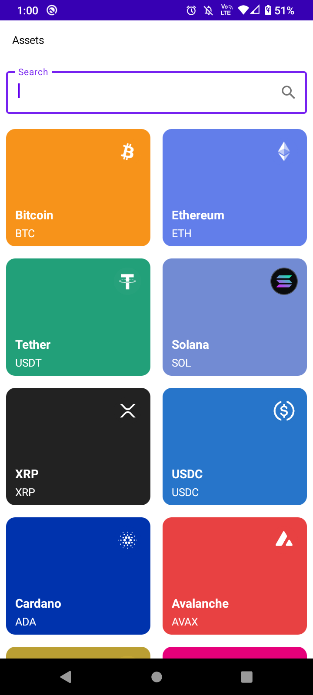

<h1>Projeto pessoal utilizando a API da Coinbase</h1>

<h2>Tecnologias utilizadas</h1>
<li>Kotlin</li> 
<li>Jetpack Compose</li> 
<li>MVVM + Clean Architecture</li> 
<li>Fluxo de dados Unidirecional</li> 
<li>Consumo de API (Retrofit + OkHttp)</li>
<li>Coroutines e Flow</li>
<li>Coil</li>

<h3>Próximas implementações</h3>
<li>Paging 3</li>
<li>Room</li>
<li>Testes unitários</li>

 